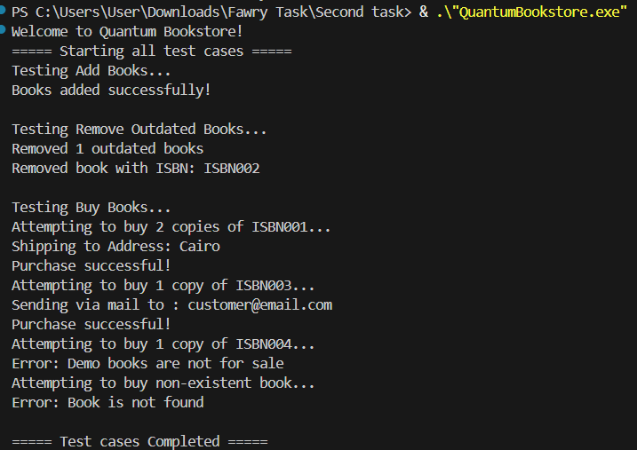

# Quantum Bookstore

A simple C++ bookstore system that manages different types of books.

## Features

- **Paper Books**: Physical books with shipping delivery
- **E-Books**: Digital books sent via email  
- **Demo Books**: Showcase books (not for sale)

## Operations

- Add books to inventory
- Remove outdated books
- Buy books with automatic delivery

## How to Run

```bash
# Compile
g++ -o QuantumBookstore QuantumBookstore.cpp

# Run
./QuantumBookstore
```

## Files

- `QuantumBookstore.cpp` - Main program
- `Book.h` - Book classes and factory
- `Store.h` - Store management
- `DeliveryMethod.h` - Delivery services
- `TestCases.h` - Test suite

## Sample Output



## Design

- Uses Factory pattern for book creation
- Extensible for new book types
- Polymorphic delivery methods
